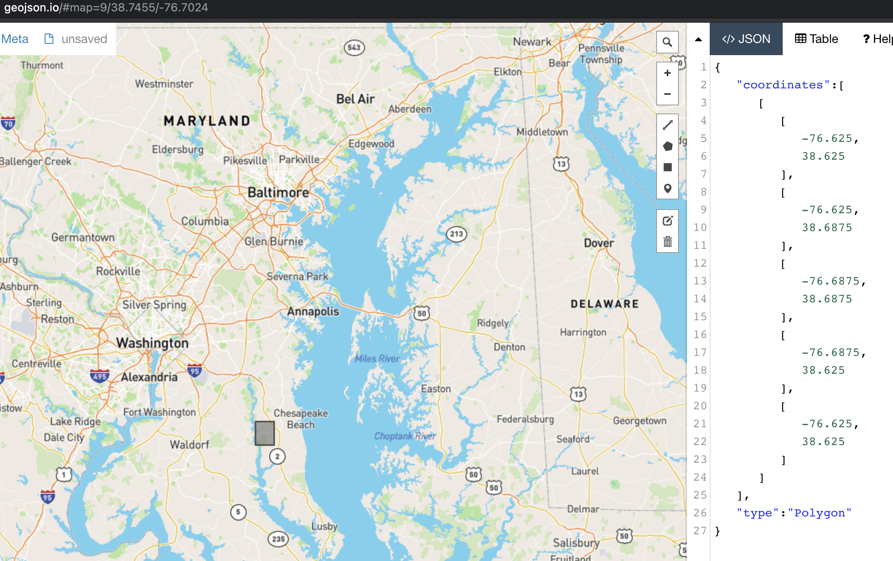

# How to read a STAC Item in the Planetary Computer STAC catalog

- [How to read a STAC Item in the Planetary Computer STAC catalog](#how-to-read-a-stac-item-in-the-planetary-computer-stac-catalog)
  - [Locate a tif asset through the Metadata Query Engine](#locate-a-tif-asset-through-the-metadata-query-engine)
    - [Previewing the contents of a Planetry Computer STAC entry](#previewing-the-contents-of-a-planetry-computer-stac-entry)

The Planetary Computer Asset Catalog is an index and store of a variety of
geospatial assets available for users to incorporate in computational pipelines
and applications. The catalog is publicly available, and users can access
everything it has to offer with some minor rate limits. If accessed from within
the appropriate Azure infrastructure, there are almost no limits on the amounts
or rates of access to this data.

In this how-to article, you will learn how to read and interpret individual STAC
items indexed in the Planetary Computer STAC catalog. We will look at the
metadata which is important for understanding what an item represents and for
retrieving asset data.

## Locate a tif asset through the Metadata Query Engine

The Metadata Query Engine (MQE) is a [STAC
API](https://stacspec.org/STAC-api.html) which allows users to explore and
search through the entirety of the Planetary Computer's offerings. Assets can be
found by reference to their spatial extent or their associated metadata. For
this how-to, we'll be looking at a single asset on a single item in the
Planetary Computer's
[NAIP](https://www.fsa.usda.gov/programs-and-services/aerial-photography/imagery-programs/naip-imagery/)
collection.

As an implementation of the STAC API, MQE entries are intended to be simple,
human-readable JSON. The item we're looking at can be found here:
[https://planetarycomputer.microsoft.com/api/stac/v1/collections/naip/items/md_m_3807619_se_18_060_20181025_20190211](https://planetarycomputer.microsoft.com/api/stac/v1/collections/naip/items/md_m_3807619_se_18_060_20181025_20190211).

### Previewing the contents of a Planetry Computer STAC entry

There are a few of fields which are very useful for previewing an entry's
contents. Satellite imagery is captured within a particular spatial and temporal
extent; most analyses which depend on satellite imagery will need to pay close
attention to the where and the when of any imagery they intend to use.

Spatial information is exposed through the `geometry` field.
```json
{
   "coordinates":[
      [
         [
            -76.625,
            38.625
         ],
         [
            -76.625,
            38.6875
         ],
         [
            -76.6875,
            38.6875
         ],
         [
            -76.6875,
            38.625
         ],
         [
            -76.625,
            38.625
         ]
      ]
   ],
   "type":"Polygon"
}
```
With this geometry and a little help from [geojson.io](http://geojson.io/), we
can see that our asset lies just to the southeast of Washington D.C.



Temporal information can be found on the `datetime` field under `properties` (in
fact, the `properties` field contains a lot of useful information). Here is the
data under the `properties` field of this item
```json
{
   "created":"2021-02-22T05:29:43Z",
   "updated":"2021-02-22T05:29:43Z",
   "providers":[
      {
         "name":"USDA Farm Service Agency",
         "roles":[
            "producer",
            "licensor"
         ],
         "url":"https://www.fsa.usda.gov/programs-and-services/aerial-photography/imagery-programs/naip-imagery/"
      }
   ],
   "gsd":0.6,
   "datetime":"2018-10-25T00:00:00Z",
   "naip:year":"2018",
   "naip:state":"md",
   "proj:epsg":26918,
   "proj:shape":[
      12814,
      10202
   ],
   "proj:bbox":[
      352847.4,
      4276115.999999999,
      358968.60000000003,
      4283804.399999999
   ],
   "proj:transform":[
      0.6,
      0,
      352847.4,
      0,
      -0.6,
      4283804.399999999,
      0,
      0,
      1
   ]
}
```

It looks a like our `Asset` was captured on October 25, 2018 just to the
southeast of Washington D.C. We can get a preview of what this sensor captured
by checking the `thumbnail` entry under `assets`.
```json
{
   "title":"Thumbnail",
   "href":"https://naipeuwest.blob.core.windows.net/naip/v002/md/2018/md_060cm_2018/38076/m_3807619_se_18_060_20181025.200.jpg",
   "type":"image/jpeg",
   "roles":[
      "thumbnail"
   ]
}
```

If we visit the contained `href` (See [How to generate SAS token/sign
requests](./02-how-to-generate-sas-token-sign-requests.md) to supply a SAS token on
the URL) we get a coarse representation of this entry. 
