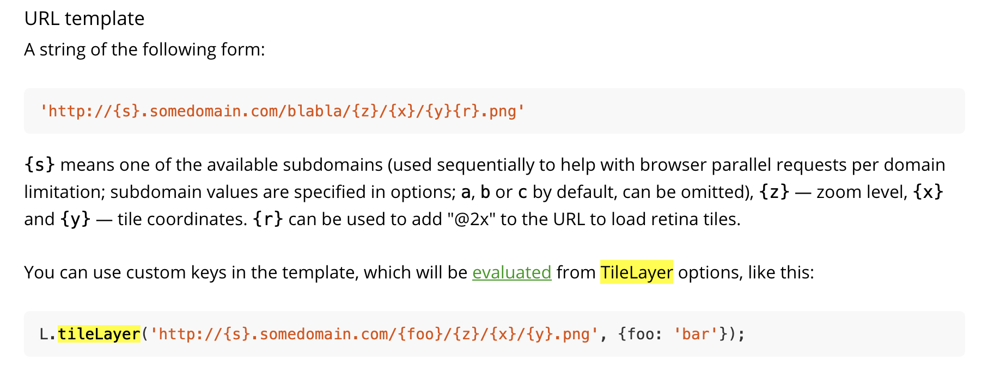

# How to tile a TIF asset from the Planetary Computer

- [How to tile a TIF asset from the Planetary Computer](#how-to-tile-a-tif-asset-from-the-planetary-computer)
  - [Prerequisites](#prerequisites)
  - [Tiling an asset](#tiling-an-asset)

The Planetary Computer Asset Catalog is an index and store of a variety of
geospatial assets available for users to incorporate in computational pipelines
and applications. If accessed from within the appropriate Azure infrastructure,
there are almost no limits on the amounts or rates of access to this data. None
of the Planetary Computer's assets are exclusive to Azure infrastructure,
however, and external users can access everything it has to offer with some
minor rate limits.

In this how-to article, you will learn how to access individual `tif` assets
indexed in the Planetary Computer's Metadata Query Engine (MQE) through the Data
Query Engine (DQE). We will look at the metadata which is important for
understanding what an item represents and constructing Data Query Engine API
calls. Turning to the Data Query Engine, we will inspect the tif asset's tiling
metadata and construct a URL template which can be used to provide tiles for a
[tiled web map](https://en.wikipedia.org/wiki/Tiled_web_map).


## Prerequisites

- [How to generate SAS token/sign
  requests](./02-how-to-generate-sas-token-sign-requests.md)
- [How to read a STAC Item in the Planetary Computer STAC
  catalog](./01-how-to-read-a-stac-item.md)


## Tiling an asset

The simplest endpoint on the DQE provides asset information necessary to
construct a tiling URL specific to one of hte supported projections. For the
purposes of this how-to we'll use this item from the STAC catalog:
[PQE_METADATA_URL/collections/naip?items/md_m_3807619_se_18_060_20181025_20190211](PQE_METADATA_URL/collections/naip/items/md_m_3807619_se_18_060_20181025_20190211).
This URL includes the collection (naip) as well as the item ID
(md_m_3807619_se_18_060_20181025_20190211). To access asset information,
'/map/tiles' is added to the metadata URL. Additionally, `item` and `assets`
query parameters specifying the item and asset for which metadata should be
retrieved must be supplied. In this case, the relevant asset found on the STAC
API is labeled 'image' With these modifications, the updated URL is
[PQE_DATA_URL/collections/naip/map/tiles?item=md_m_3807619_se_18_060_20181025_20190211&assets=image](PQE_DATA_URL/collections/naip/map/tiles?item=md_m_3807619_se_18_060_20181025_20190211&assets=image).

An extent property is provided which describes the region for which meaningful
tiles can be expected.
```json
{
   "spatial":{
      "bbox":[
         [
            -76.69198556156623,
            38.621369461223104,
            -76.6200684427915,
            38.69162323586947
         ]
      ]
   }
}
```

In addition, a list of tile matrix sets is provided, each of which defines a
[tiling
pyramid](https://northstar-www.dartmouth.edu/doc/idl/html_6.2/Image_Tiling.html)
supported by the Planetary Computer DQE. The most common of the supported tile
matrix sets is 'WebMercatorQuad', otherwise known as [Web
Mercator](https://en.wikipedia.org/wiki/Web_Mercator_projection) or
[WGS84](https://spatialreference.org/ref/sr-org/epsg3857-wgs84-web-mercator-auxiliary-sphere/).
This full list is located under the key 'tileMatrixSetLinks':
```json
[
   {
      "tileMatrixSet":"LINZAntarticaMapTilegrid",
      "tileMatrixSetURI":"PQE_DATA_URL/tileMatrixSets/LINZAntarticaMapTilegrid"
   },
   {
      "tileMatrixSet":"CanadianNAD83_LCC",
      "tileMatrixSetURI":"PQE_DATA_URL/tileMatrixSets/CanadianNAD83_LCC"
   },
   {
      "tileMatrixSet":"NZTM2000",
      "tileMatrixSetURI":"PQE_DATA_URL/tileMatrixSets/NZTM2000"
   },
   {
      "tileMatrixSet":"UPSAntarcticWGS84Quad",
      "tileMatrixSetURI":"PQE_DATA_URL/tileMatrixSets/UPSAntarcticWGS84Quad"
   },
   {
      "tileMatrixSet":"WorldCRS84Quad",
      "tileMatrixSetURI":"PQE_DATA_URL/tileMatrixSets/WorldCRS84Quad"
   },
   {
      "tileMatrixSet":"WorldMercatorWGS84Quad",
      "tileMatrixSetURI":"PQE_DATA_URL/tileMatrixSets/WorldMercatorWGS84Quad"
   },
   {
      "tileMatrixSet":"UPSArcticWGS84Quad",
      "tileMatrixSetURI":"PQE_DATA_URL/tileMatrixSets/UPSArcticWGS84Quad"
   },
   {
      "tileMatrixSet":"WebMercatorQuad",
      "tileMatrixSetURI":"PQE_DATA_URL/tileMatrixSets/WebMercatorQuad"
   },
   {
      "tileMatrixSet":"UTM31WGS84Quad",
      "tileMatrixSetURI":"PQE_DATA_URL/tileMatrixSets/UTM31WGS84Quad"
   },
   {
      "tileMatrixSet":"EuropeanETRS89_LAEAQuad",
      "tileMatrixSetURI":"PQE_DATA_URL/tileMatrixSets/EuropeanETRS89_LAEAQuad"
   }
]
```

The final piece of information provided by the DQE API's info endpoint is a
templated URL which can be used by Leaflet, OpenLayers, Bing Maps or just about
any web mapping library to display this NAIP asset at varying resolutions and
projections. This template can be found in the array of links with the key
'links':
```json
[
   {
      "title":"Slippy Map Tiles",
      "href":"PQE_DATA_URL/collections/naip/map/tiles/{tileMatrixSetId}/{tileMatrixZoom}/{tileRow}/{tileCol}.{format}?item=md_m_3807619_se_18_060_20181025_20190211&assets=image",
      "rel":"item",
      "type":"image/png",
      "templated":true
   }
]
```

The template in this case is
"PQE_DATA_URL/collections/naip/map/tiles/{tileMatrixSetId}/{tileMatrixZoom}/{tileRow}/{tileCol}.{format}?item=md_m_3807619_se_18_060_20181025_20190211&assets=image".
A bit more information is required for this to work well with web mapping
libraries.

First, tileMatrixSetId needs to be one of the supported tile matrix sets above.
Let's keep things simple: we'll use Web Mercator. Its ID is 'WebMercatorQuad',
so our updated URL should be
"PQE_DATA_URL/collections/naip/map/tiles/WebMercatorQuad/{tileMatrixZoom}/{tileRow}/{tileCol}.{format}?item=md_m_3807619_se_18_060_20181025_20190211&assets=image"

Actually viewing this image will require the selection of some specific subset
of the available bands on the tif. One or more bands will need to be provided
via query parameter (just like we did with assets above). To provide a single
band, the updated query parameters might be
"?item=md_m_3807619_se_18_060_20181025_20190211&assets=image&bidx=1". In this
case, however, we want to view an RGB composite. Luckily, that's exactly what
the DQE assumes when three bands are provided. The only thing necessary is to
separate bands with a comma. The updated template should now look like this:
"PQE_DATA_URL/collections/naip/map/tiles/WebMercatorQuad/{tileMatrixZoom}/{tileRow}/{tileCol}.{format}?item=md_m_3807619_se_18_060_20181025_20190211&assets=image&bidx=1,2,3"

The final necessary modification is to convert tileMatrixZoom, tileRow, and
tileCol to the expected template values for the web mapping library being used
to display this tile layer and to select a format for the returned imagery. For
this how-to we'll use a very simple [leaflet map tile
layer](https://leafletjs.com/reference-1.7.1.html#tilelayer) (if you prefer one
of the alternatives, don't worry: the other web mapping libraries are quite
similar).

 Leaflet's
documentation indicates that {z}, {x}, and {y} are the preferred template values
for tile pyramids, so we'll switch tileMatrixZoom, tileRow, and tileCol to
those, respectively. That should leave us with the template URL
"PQE_DATA_URL/collections/naip/map/tiles/WebMercatorQuad/{z}/{x}/{y}.{format}?item=md_m_3807619_se_18_060_20181025_20190211&assets=image&bidx=1,2,3"

The only remaining decision is what format we'd like. Available extensions are:
`png`, `npy` (yes, numpy tiles are supported!), `tif`, "`jpg`, `jp2`, `webp`,
and `pngraw`. Web mapping libraries typically play nicely with `png`, so let's
specify that. At this point, the template should be ready for use in Leaflet:
"PQE_DATA_URL/collections/naip/map/tiles/WebMercatorQuad/{z}/{x}/{y}.png?item=md_m_3807619_se_18_060_20181025_20190211&assets=image&bidx=1,2,3"

Copy the HTML below into a new file named "index.html" and open it with your
browser of choice to see a tiled web map for the selected NAIP asset.

```html
<html>
    <head>
        <link rel="stylesheet" href="https://unpkg.com/leaflet@1.7.1/dist/leaflet.css"
            integrity="sha512-xodZBNTC5n17Xt2atTPuE1HxjVMSvLVW9ocqUKLsCC5CXdbqCmblAshOMAS6/keqq/sMZMZ19scR4PsZChSR7A=="
            crossorigin=""/>
    </head>
    <body>
        <div id="map" style="position:fixed;right:0px;left:0px;height:100%;">
        </div>
        <script src="https://unpkg.com/leaflet@1.7.1/dist/leaflet.js"
            integrity="sha512-XQoYMqMTK8LvdxXYG3nZ448hOEQiglfqkJs1NOQV44cWnUrBc8PkAOcXy20w0vlaXaVUearIOBhiXZ5V3ynxwA=="
            crossorigin="">
        </script>
        <script>
            var map = L.map('map', {
                center: {lat: 38.652024950540856, lng: -76.65505472919905},
                zoom: 13
            });
            var Stamen_TonerLite = L.tileLayer('http://stamen-tiles-{s}.a.ssl.fastly.net/toner-lite/{z}/{x}/{y}.png', {
                attribution: 'Map tiles by <a href="http://stamen.com">Stamen Design</a>, <a href="http://creativecommons.org/licenses/by/3.0">CC BY 3.0</a> &mdash; Map data &copy; <a href="http://www.openstreetmap.org/copyright">OpenStreetMap</a>',
                subdomains: 'abcd',
                minZoom: 0,
                maxZoom: 20
            }).addTo(map);

            var mosaicLayer = L.tileLayer("PQE_DATA_URL/collections/naip/map/tiles/WebMercatorQuad/{z}/{x}/{y}.png?item=md_m_3807619_se_18_060_20181025_20190211&assets=image&bidx=1,2,3", {
                minZoom: 12,
                maxZoom: 18
            }).addTo(map);
        </script>
    </body>
</html>
```
