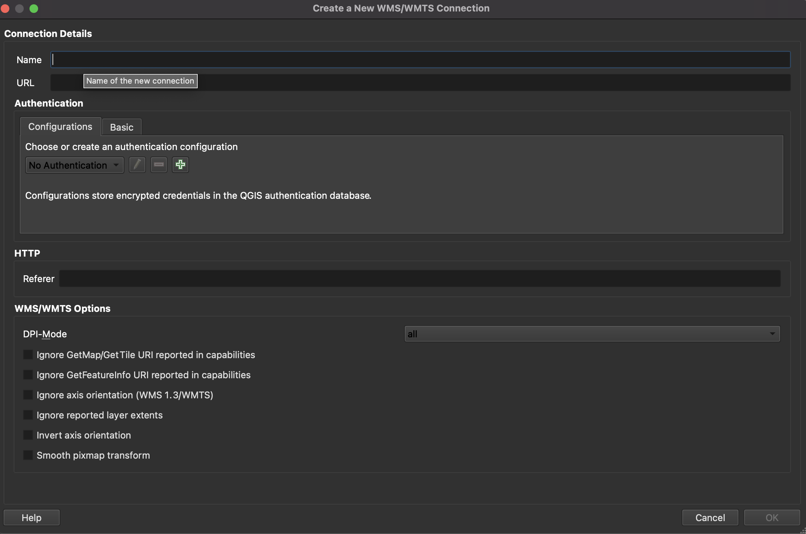

# How to access a TIF asset with QGIS through the WMTS protocol

- [How to access a TIF asset with QGIS through the WMTS protocol](#how-to-access-a-tif-asset-with-qgis-through-the-wmts-protocol)
  - [Prerequisites](#prerequisites)
  - [Constructing the WMTS URL](#constructing-the-wmts-url)
  - [Adding a WMTS layer to QGIS](#adding-a-wmts-layer-to-qgis)

The Planetary Computer Asset Catalog is an index and store of a variety of
geospatial assets available for users to incorporate in computational pipelines
and applications. If accessed from within the appropriate Azure infrastructure,
there are almost no limits on the amounts or rates of access to this data. None
of the Planetary Computer's assets are exclusive to Azure infrastructure,
however, and external users can access everything it has to offer with some
minor rate limits.

In this how-to article, you will learn how to access individual `tif` assets
indexed in the Planetary Computer's STAC catalog with the help of QGIS and the
[WMTS protocol](https://www.ogc.org/standards/wmts).

## Prerequisites

- [Install QGIS](https://qgis.org/en/site/forusers/download.html)
- [How to generate SAS token/sign
  requests](./02-how-to-generate-sas-token-sign-requests.md)
- [How to read a STAC Item in the Planetary Computer STAC
  catalog](./01-how-to-read-a-stac-item.md)

## Constructing the WMTS URL

First, refer  to the [API documentation](https://planetarycomputer.microsoft.com/api/data/v1/docs). There, the URL
template for WMTS connections is available:
`https://planetarycomputer.microsoft.com/api/data/v1/pctiler/{TileMatrixSet}/WMTSCapabilities.xml` In addition to the
base URL, a few query parameters will be necessary: the collection, item, asset,
and set of bands which jointly define the minimal set of information necessary
to view a TIF stored in the Planetary Computer's STAC catalog. Here's what the
query parameter template might look like:
`?collection={collection_id}&items={item_id}&assets={asset}&bidx={bands}`.

For the purposes of this how to, we'll look at the item
al_m_3008503_ne_16_060_20191118_20200114 within the naip collection. The asset
which refers to the full scale TIF is 'image' and the first three bands are R,
G, and B. Using the popular WebMercatorQuad projection and tile matrix set, that
leaves the URL:
https://planetarycomputer.microsoft.com/api/data/v1/pctiler/WebMercatorQuad/WMTSCapabilities.xml?collection=naip&items=al_m_3008503_ne_16_060_20191118_20200114&assets=image&bidx=1,2,3
Next, we will use this URL to add a WMTS layer to QGIS.

## Adding a WMTS layer to QGIS

With QGIS open, go to `Layer > Add Layer > Add WMS/WMTS layer...` 

Select `New` to add a new WMTS layer source 

Add a name/label to keep track of this layer, and paste the URL constructed
above
(https://planetarycomputer.microsoft.com/api/data/v1/pctiler/WebMercatorQuad/WMTSCapabilities.xml?collection=naip&items=al_m_3008503_ne_16_060_20191118_20200114&assets=image&bidx=1,2,3)
into the URL field. Hit "OK" once it is the Name and URL fields are completed

Connect to the newly defined layer and hit 'Add' 

That's it! You should have a tiled layer available for inspection in your QGIS
client. 
