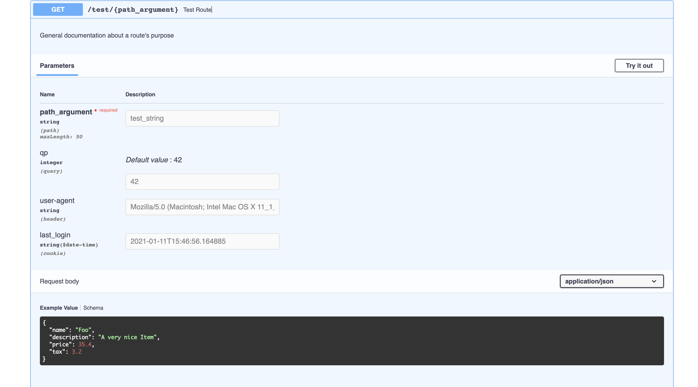

# API Documentation

We chose `FastAPI` because of its performance, its use by Titiler, and because it leverages function structure and type annotations to automatically generate `openapi` JSON which can be viewed with `Swagger` (`/docs`) and `Redoc` (`/redoc`).
To demonstrate the capacities of this documentation generation, we'll be looking at a simple (contrived) example.
Below is an example of what the generated route parameter documentation and its corresponding code looks like.

Source:
```python
from fastapi import Body, Path, Query, Header, Cookie
from pydantic import BaseModel, Field

class TestItem(BaseModel):
    """A fake item to demonstrate the use of pydantic types in doc generation"""
    name: str = Field(..., example="Foo")
    description: Optional[str] = Field(None, example="A very nice Item")
    price: float = Field(..., example=35.4)
    tax: Optional[float] = Field(None, example=3.2)

@app.get("/test/{path_argument}", response_model=TestItem)
def test_route(
    path_argument: str = Path(
        ...,
        example="test_string",
        max_length=50
    ),
    request_body: TestItem = Body(
        TestItem(name="bag of chips", price=3.45),
        example={
            "name": "Foo",
            "description": "A very nice Item",
            "price": 35.40,
            "tax": 3.20,
        },
    ),
    qp: int = Query(
        42,
        example=42
    ),
    user_agent: Optional[str] = Header(
        None,
        example="Mozilla/5.0 (Macintosh; Intel Mac OS X 11_1_0) AppleWebKit/537.36 (KHTML, like Gecko) Chrome/87.0.4280.88 Safari/537.36"
    ),
    last_login: Optional[datetime] = Cookie(
        None,
        example=datetime.now()
    )
):
    """General documentation about a route's purpose"""
    return request_body
```

Redoc:


Swagger:




### Pydantic

To use the custom class `TestItem` defined above directly and still get full support in documentation, all that is required is that our class be defined with some `pydantic` helpers.
The class inherits from `pydantic`s `BaseModel` and registers all serialized fields with `pydantic`s `Field:

```python
from pydantic import BaseModel, Field

class TestItem(BaseModel):
    """A fake item to demonstrate the use of pydantic types in doc generation"""
    name: str = Field(..., example="Foo")
    description: Optional[str] = Field(None, example="A very nice Item")
    price: float = Field(..., example=35.4)
    tax: Optional[float] = Field(None, example=3.2)
```


### Route Parameters

Route parameters are all instances of the class `Param` and share its structure.
These `Param` types encode the various pieces of information which distinguish different requests.
Each `Param` instance takes a default value (or `...` to signify that there is no default) as well as a number optional of named arguments.
The most common `Param` instances are: `Path`, `Query`, `Body`, `Cookie`, `Header`.

Also provided (though not discussed here) are `File` and `Form`: https://github.com/tiangolo/fastapi/blob/master/fastapi/params.py#L245-L313

As in the example above, these `Param` instances are only used within the argument list and are not used as types within argument function signatures.
I.E. a parameter with the `int` type might have a corresponding value, `Query`, provided.

Of special note is how to handle cases without default values.
If a value is *required* and thus has no default, `...` is used as the default value argument (e.g. `Path(...)`)
A truly optional field for which the default is not provided is better represented by using the `Optional` type signature and `None` as the `Param`'s default value (e.g. `Query(None)`)

##### Path Parameters

`Path` parameters are those which are provided by parsing a portion of the route URL.

A `Path` parameter providing *no* default, an example value, and a maximum length validation
```python
Path(
    ...,
    example="test_string",
    max_length=50
)
```


##### Query Parameters

`Query` parameters are attached to a request after `?` and are provided as key-value pairs, separated by `&`.

A `Query` parameter with example value
```python
qp: int = Query(
    42,
    example=42
)
```

`Query` params are unique among parameters in that they allow plural values.
[Here's](https://fastapi.tiangolo.com/tutorial/query-params-str-validations/#query-parameter-list-multiple-values) a discussion on deriving lists of values from query parameters.


##### The Body Parameter

The `Body` parameter is data, typically JSON, which constitutes the primary payload of the request it is submitted with.
These are generally not included on `GET` requests, though the suggested HTTP server semantics encourage responses to avoid being parametric on the body's payload.

A `Body` parameter taking full advantage of the `pydantic` class type extensions.
```python
Body(
    TestItem(name="zing", price=3.45),
    example={
        "name": "Foo",
        "description": "A very nice Item",
        "price": 35.40,
        "tax": 3.20,
    }
)
```

##### Cookie Parameters

Cookie parameters encode key-value pairs which can persist between request-response cycles and are often used for sending around tokens or application data.


A `Cookie` parameter which illustrates out of the box support for types you might not expect (`datetime.datetime`).
[Here are some more supported types.](https://fastapi.tiangolo.com/tutorial/extra-data-types/)
```python
Cookie(
    None,
    example=datetime.now()
)
```


##### Header Parameters

Header parameters are most generally used to transmit metadata.
The 'user agent' string which describes the device and operating system of the requester is one such bit of metadata.

A `Header` param with example user_agent string:
```python
Header(
    None,
    example="Mozilla/5.0 (Macintosh; Intel Mac OS X 11_1_0) AppleWebKit/537.36 (KHTML, like Gecko) Chrome/87.0.4280.88 Safari/537.36"
)
```

#### Providing Examples

An important task when documenting routes is providing examples of the sorts of values which will be consumed by said routes.
This is done inside the body of a `Param` by providing a value to the keyword parameter `example`.
Rather than provide an example instance of the data consumed under a given parameter, the serialized JSON representation expected by the route is the provided.


#### Validating Parameters

Parameter validation is useful for prohibiting bad data from being consumed by endpoints but it serves to document the API for users.
They are provided as keyword arguments just as `max_length` is on the above `Path`
Here are the available validations:
- `gt`: numeric greater than
- `ge`: numeric greater than or equal
- `lt`: numeric less than
- `le`: numeric less than or equal
- `min_length`: minimum string length
- `max_length`: maximum string length
- `regex`: regular expression validation (see here: https://fastapi.tiangolo.com/tutorial/query-params-str-validations/#add-regular-expressions) 

Documentation relevant to validations:
- [string validations](https://fastapi.tiangolo.com/tutorial/query-params-str-validations/#add-more-validations)
- [numeric validations](https://fastapi.tiangolo.com/tutorial/path-params-numeric-validations/#number-validations-greater-than-or-equal)


#### Extra

There are a few miscellaneous extra bits of metadata and behavior provided as keyword arguments available on `Param` instances:
- `alias`: allows alternative strings to be used for looking up arguments (https://fastapi.tiangolo.com/tutorial/query-params-str-validations/#alias-parameters)
- `deprecated`: marks a parameter as deprecated in documentation
- `title`: the title for this parameter within documentation
- `description`: a natural language description of some parameter


### Route Responses

The decorator below tells `FastAPI` that the method it decorates responds to `GET` requests on the path `/test/{path_argument}` (where path_argument is variable).
It also communicates the response type that can be expected from this route through the keyword argument `response_model`.

```python
@app.get("/test/{path_argument}", response_model=TestItem)
```

If a route returns multiple different types depending on the arguments it receives, this can be modeled by passing a `List` of `pydantic` models rather than just one:

```python
# OtherModel is an alternative return type here
@app.get("/test/{path_argument}", response_model=List[TestItem, OtherModel])
```

### Route description

A general, top level route description can be provided by writing a docstring for the function which defines a route.